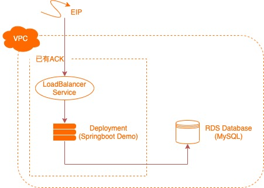
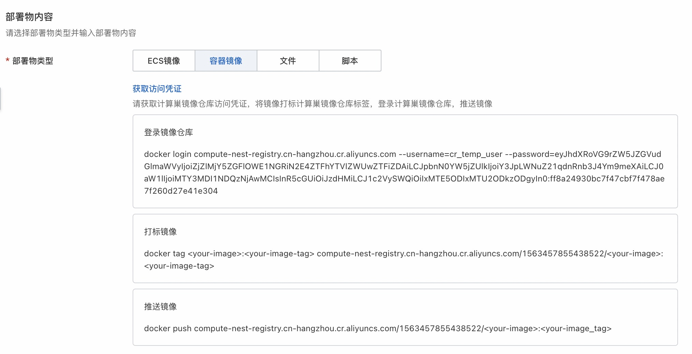
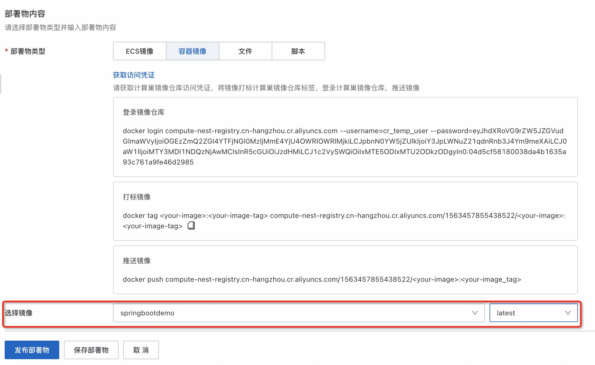
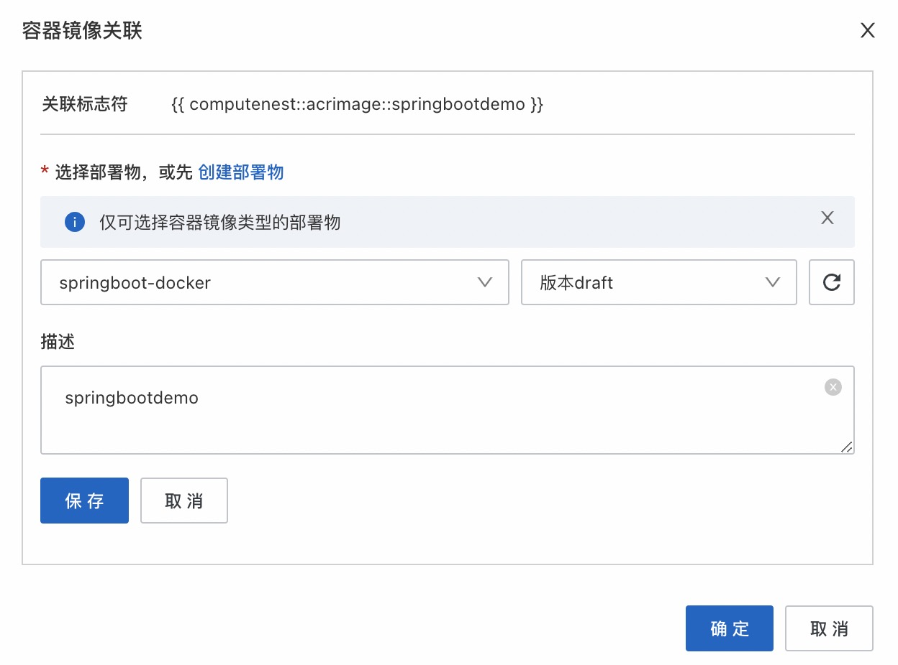

# 场景说明

本文介绍在计算巢部署容器应用+RDS数据库(MySQL)的部署场景。在这个场景中，我们会将容器应用部署至一个已有ACK中，并且新建一个RDS数据库作为应用的持久化存储。

我们使用一个基本的Web示例程序。在这个示例程序中预置了数据库初始化脚本，使得在程序启动后会自动初始化数据库。在数据库初始化完成后，会向数据库中插入一条包含ComputeNest名字的数据。我们可以通过示例程序提供的API查询数据库，并且可以看到返回结果Hello ComputeNest。 

您可以通过如下命令拉取示例程序镜像到本地电脑。如果您对Java技术栈有所了解，也可以尝试从源代码自己构建示例程序。请参考project目录下的[readme](project/readme.md)文件。

```shell
docker pull compute-nest-test-registry.cn-hangzhou.cr.aliyuncs.com/bestpractice/springboot-demo:latest
```

在本示例中，您需要将示例程序镜像从本地推送至计算巢用于ISV托管镜像的私有ACR镜像仓库中。在您真实的生产场景中，可以使用任意技术栈实现Web应用，只需满足最终交付容器镜像这个条件即可。



## 前提条件

我们假设您已经具备Docker以及Kubernetes相关的技术知识，除此之外您还需要对[阿里云ROS](https://www.aliyun.com/product/ros)模版语法有所了解。

您可以通过这个索引查看本场景中必须的ROS资源和函数

- 资源
  - [容器应用(ClusterApplication)](https://help.aliyun.com/document_detail/459117.html)
  - [RDS实例(DBInstance)](https://help.aliyun.com/document_detail/51200.html)
  - [RDS Schema(Database)](https://help.aliyun.com/document_detail/177450.html)
  - [RDS 用户(DBAccount)](https://help.aliyun.com/document_detail/111904.html)
- 函数
  - [Fn::Sub](https://help.aliyun.com/document_detail/28865.html#section-7pm-51h-0v9-1)

## 操作步骤

### 上传Docker镜像至计算巢镜像仓库

在计算巢[部署物管理](https://computenest.console.aliyun.com/vendor/cn-hangzhou/artifact/create)控制台获取计算巢容器镜像仓库访问凭证、推送镜像、创建部署物。您可以在部署物管理[官方文档](https://help.aliyun.com/document_detail/432428.html)查看创建部署物步骤和配置项。

1. 获取计算巢镜像仓库访问凭证



2. 推送镜像

使用Docker命令行工具登录计算巢镜像仓库，然后推送镜像。


### 创建计算巢容器部署物



### 创建计算巢服务

使用ROS模版template.yml在计算巢[服务管理](https://computenest.console.aliyun.com/vendor/cn-hangzhou/serviceCreate)控制台创建服务。您可以在服务管理[官方文档](https://help.aliyun.com/document_detail/406718.html)查看创建服务步骤和配置项。

1. ROS模版ClusterApplication说明

由于我们在容器部署时，需要拉取计算巢私有镜像仓库中的镜像。因此ACK集群需要具备访问计算巢私有镜像仓库的能力。在此我们定义了一个dockerconfigjson类型的Secret，并使用计算巢标识符{{ computenest::acr::dockerconfigjson }}。

```yaml
ClusterApplication:
  DependsOn: Database
  Type: ALIYUN::CS::ClusterApplication
  Properties:
    ClusterId:
      Ref: ClusterId
    YamlContent:
      Fn::Sub:
        - |
        # 省略...
          apiVersion: v1
          data:
            .dockerconfigjson: {{ computenest::acr::dockerconfigjson }}
          kind: Secret
          metadata:
            name: computenestrepo
            namespace: ${NameSpace}
          type: kubernetes.io/dockerconfigjson
        # 省略...
```

另外，我们通过{{ computenest::acrimage::springbootdemo }}标识符将模版中的image关联至计算巢部署物。

```yaml
ClusterApplication:
  DependsOn: Database
  Type: ALIYUN::CS::ClusterApplication
  Properties:
    ClusterId:
      Ref: ClusterId
    YamlContent:
      Fn::Sub:
        - |
        # 省略...
          apiVersion: apps/v1
          kind: Deployment
          metadata:
            labels:
              app: springboot-demo-deployment
            name: springboot-demo-deployment
            namespace: ${NameSpace}
          spec:
            progressDeadlineSeconds: 600
            replicas: 2
            revisionHistoryLimit: 10
            selector:
              matchLabels:
                app: springboot-demo-pod
            template:
              metadata:
                labels:
                  app: springboot-demo-pod
              spec:
                containers:
                  - env:
                      - name: DB_HOST
                        value: ${RdsConnectString}
                      - name: DB_USER
                        value: ${DbUser}
                      - name: DB_PASSWORD
                        value: ${DbPassword}
                    image: {{ computenest::acrimage::springbootdemo }}
                    imagePullPolicy: Always
                    name: springboot-demo-container
                    ports:
                      - containerPort: 8080
                        protocol: TCP
                imagePullSecrets:
                  - name: computenestrepo
                restartPolicy: Always
        # 省略...
```

2. 配置容器镜像关联



### 创建计算巢服务实例

在创建服务后，我们打开服务的部署链接创建服务实例。我们需要填写服务实例地域、可用区、VPC、ACK集群名称及namespace等信息。


我们可以通过kubectl命令行工具查看LoadBalancer访问端点，并访问API。

